# Security Assessment Report

**Report Dates:** December 3–5, 2025  
**Targets Tested:** `pizza.skycs329.click`, `pizza.thegamevault.click`

---

# Peers:
- Skyler Williams
- Ruben Matos

# Self Attack Records (Ruben Matos)

| Item           | Result                                                                         |
| -------------- | ------------------------------------------------------------------------------ |
| Date           | December 3, 2025                                                               |
| Target         | pizza.theGameVault.click                                                       |
| Classification | Path Traversal                                                                 |
| Severity       | 2                                                                              |
| Description    | Docs were completely open for path traversal without authorization             |
| Images         | I forgot to take one.                                                          |
| Corrections    | added a sanitizePath function that prevents path traversal attempts            |

| Item           | Result                                                                         |
| -------------- | ------------------------------------------------------------------------------ |
| Date           | December 4, 2025                                                               |
| Target         | pizza.theGameVault.click                                                       |
| Classification | Security Misconfiguration                                                      |
| Severity       | 2                                                                              |
| Description    | I didn't change the admin password from being 'admin'                          |
| Images         | This one doesn't need a pic                                                    |
| Corrections    | Updated the admin password to something more secure (no it's not 'cow')        |

| Item           | Result                                                                         |
| -------------- | ------------------------------------------------------------------------------ |
| Date           | December 4, 2025                                                               |
| Target         | pizza.theGameVault.click                                                       |
| Classification | Authorization                                                                  |
| Severity       | 3                                                                              |
| Description    | I actually tried a bunch of different things here but couldn't get admin access through hacking, but I had AI double check and a bunch of vulnerabilities. Having the token in local storage is bad and having them never die means whoever gets a hold of a token will always have access to that account, especially since they can add the token to localstorage and get in.                         |
| Images         | This one doesn't need a pic                                                    |
| Corrections    | The backend needs to enforce all authorization and give the tokens an expiration date       |

| Item           | Result                                                                         |
| -------------- | ------------------------------------------------------------------------------ |
| Date           | December 4, 2025                                                               |
| Target         | pizza.theGameVault.click                                                       |
| Classification | Broken access control                                                                  |
| Severity       | 3                                                                              |
| Description    | I'll be honest, I don't know how I would go about doing this one, but in the pizza service it's set up so any user can delete any other user, including admins. If someone uses a tool like Burp Suite, they can get a list of all users without being an admin and can even delete any user without authorization.                          |
| Images         | no pic                                                    |
| Corrections    | Add authorizition in backend to only allow admins to delete users, or for users to delete themselves (deleting an account)       |

| Item           | Result                                                                         |
| -------------- | ------------------------------------------------------------------------------ |
| Date           | December 4, 2025                                                               |
| Target         | pizza.theGameVault.click                                                       |
| Classification | SQL Injection                                                                  |
| Severity       | 1                                                                              |
| Description    | SQL injection can delete the database or mess with all user info, I saw where it could happen and the code clearly showed vulnerabilities, but I didn't want to go through the hassle of wrecking my db and trying to recreate it again. It was found in the update user info fields and creating user info fields.                        |
| Images         | no pic                                                    |
| Corrections    | Sanatized user inputs in the backend to prevent this      |

# Self Attack Records (Skyler Williams)

## Security Misconfiguration — Admin Password Guessed

| Item                   | Result                 | Date             | Target               | Classification            | Severity |
| ---------------------- | ---------------------- | ---------------- | -------------------- | ------------------------- | -------- |
| Admin Password Guessed | Admin password guessed | December 4, 2025 | pizza.skycs329.click | Security Misconfiguration | 4        |

**Description**  
Admin password guessed. Hacker able to access private information and manage data they shouldn’t.

**Images**  
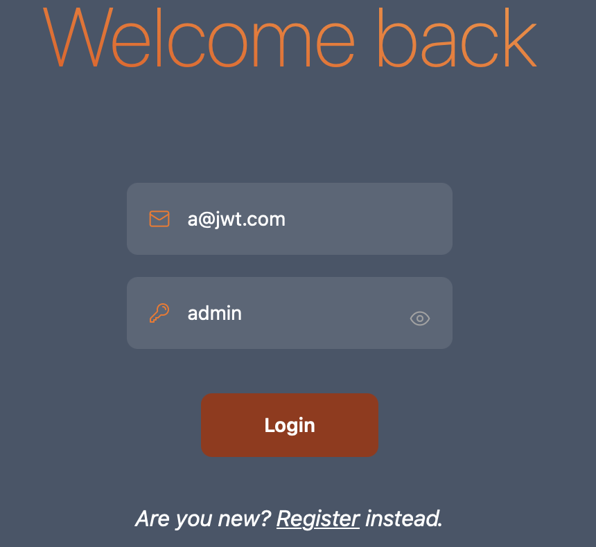

**Corrections**  
Changed passwords from their default.

---

## Broken Access Control — Delete Any User With Valid Token

| Item                  | Result                                     | Date             | Target               | Classification        | Severity |
| --------------------- | ------------------------------------------ | ---------------- | -------------------- | --------------------- | -------- |
| Delete Arbitrary User | Able to delete any user with a valid token | December 4, 2025 | pizza.skycs329.click | Broken Access Control | 3        |

**Description**  
Able to delete whatever users I want with a valid token.

**Images**  
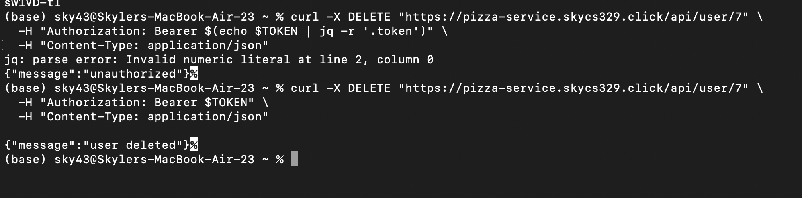

**Corrections**  
Added role validation before allowing deletion.

---

## Broken Access Control — Delete Any Franchise

| Item                       | Result                       | Date             | Target               | Classification        | Severity |
| -------------------------- | ---------------------------- | ---------------- | -------------------- | --------------------- | -------- |
| Delete Arbitrary Franchise | Able to delete any franchise | December 4, 2025 | pizza.skycs329.click | Broken Access Control | 3        |

**Description**  
Able to delete whatever franchise I want.

**Images**  
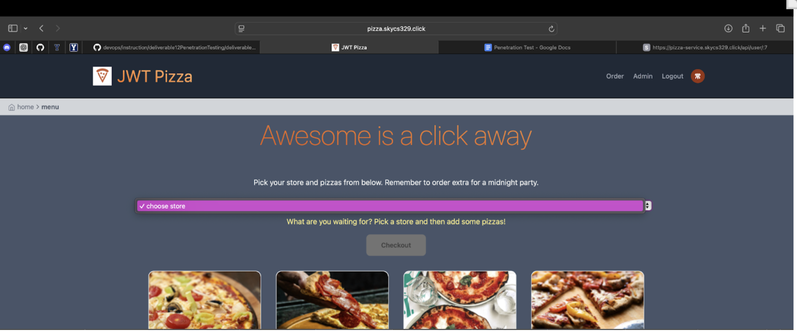
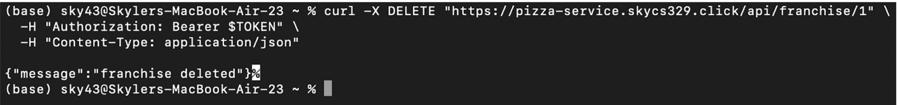

**Corrections**  
Added role + auth token validation before allowing deletion.

---

## Improper Session Management — Auth Token in Local Storage

| Item                                | Result             | Date             | Target               | Classification              | Severity |
| ----------------------------------- | ------------------ | ---------------- | -------------------- | --------------------------- | -------- |
| Auth Token Visible in Local Storage | Auth token visible | December 4, 2025 | pizza.skycs329.click | Improper Session Management | 1        |

**Description**  
Able to see a user’s auth token in local storage.

**Images**  
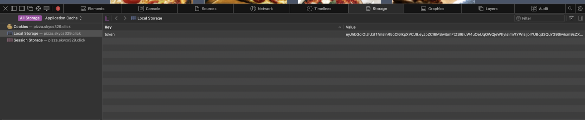

**Corrections**  
Ensured no one can access anything with a broken or exposed auth token.

---

## Server-Side Request Forgery (SSRF) — Franchise Info Accessible

| Item                             | Result                         | Date             | Target               | Classification              | Severity |
| -------------------------------- | ------------------------------ | ---------------- | -------------------- | --------------------------- | -------- |
| SSRF — Franchise Info Accessible | Able to request franchise info | December 4, 2025 | pizza.skycs329.click | Server Side Request Forgery | 2        |

**Description**  
Able to request the franchises and see the info that goes with them.

**Images**  
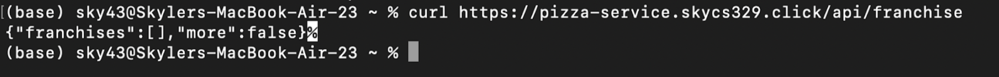

**Corrections**  
Added auth token requirement to access stores.

# Peer Attack Records (Ruben Matos --> Skyler Williams)

| Item           | Result                                                                         |
| -------------- | ------------------------------------------------------------------------------ |
| Date           | December 5, 2025                                                               |
| Target         | https://pizza.skycs329.click                                                   |
| Classification | Information Disclosure                                                         |
| Severity       | 3                                                                              |
| Description    | Homie never changed the admin password from being "admin" (*hacker voice*: I'm in)            |
| Images         |                                                           |
| Corrections    | change the password                                |

| Item           | Result                                                                         |
| -------------- | ------------------------------------------------------------------------------ |
| Date           | December 5, 2025                                                               |
| Target         | https://pizza.skycs329.click                                                   |
| Classification | Path Traversal                                                                 |
| Severity       | 2                                                                              |
| Description    | Docs were completely open to anyone to access by simply typing /docs in the url path. I had a solid documentation for all api endpoints which could easily be exploited.              |
| Images         |                                                        |
| Corrections    | ensure your docs are more secure and check for sneaky path vulnerabilities.          |

| Item           | Result                                                                         |
| -------------- | ------------------------------------------------------------------------------ |
| Date           | December 5, 2025                                                               |
| Target         | https://pizza.skycs329.click                                                   |
| Classification | Broken Access Control                                                          |
| Severity       | 2                                                                              |
| Description    | By using Burp Suite I can change the price of the pizzas I order and still get a valid JWT Pizza token without paying anything.               |
| Images         |                                                        |
| Corrections    | I don't know how you'd fix this one tbh                                        |

| Item           | Result                                                                         |
| -------------- | ------------------------------------------------------------------------------ |
| Date           | December 5, 2025                                                               |
| Target         | https://pizza.skycs329.click                                                   |
| Classification | SQL Injection                                                          |
| Severity       | -                                                                              |
| Description    | I attempted a simple SQL Injection attack but it failed, good job! I couldn't hit the submit button with SQL code in the user input field.                |
| Images         |                                                        |
| Corrections    | Already corrected                                        |

# Peer Attack Records (Skyler Williams --> Ruben Matos)

## Security Misconfiguration — Franchisee Password Guessed

| Item                        | Result           | Date             | Target                   | Classification            | Severity |
| --------------------------- | ---------------- | ---------------- | ------------------------ | ------------------------- | -------- |
| Franchisee Password Guessed | Password guessed | December 5, 2025 | pizza.thegamevault.click | Security Misconfiguration | 4        |

**Description**  
Franchisee password guessed. Hacker able to access private information and manage data they shouldn’t.

**Images**  
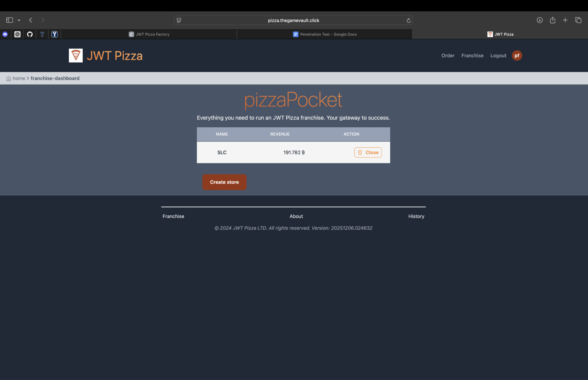

**Corrections**  
(Not specified)

---

## Broken Access Control — User Deletion Not Possible (PASS)

| Item                  | Result                   | Date             | Target                   | Classification        | Severity |
| --------------------- | ------------------------ | ---------------- | ------------------------ | --------------------- | -------- |
| User Deletion Attempt | Not able to delete users | December 5, 2025 | pizza.thegamevault.click | Broken Access Control | 0        |

**Description**  
Attempting to delete users failed — expected behavior.

**Images**  
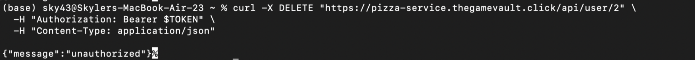

**Corrections**  
None required.

---

## Broken Access Control — Delete Any Franchise

| Item                       | Result                       | Date             | Target                   | Classification        | Severity |
| -------------------------- | ---------------------------- | ---------------- | ------------------------ | --------------------- | -------- |
| Delete Arbitrary Franchise | Able to delete any franchise | December 5, 2025 | pizza.thegamevault.click | Broken Access Control | 3        |

**Description**  
Able to delete whatever franchise I want.

**Images**  
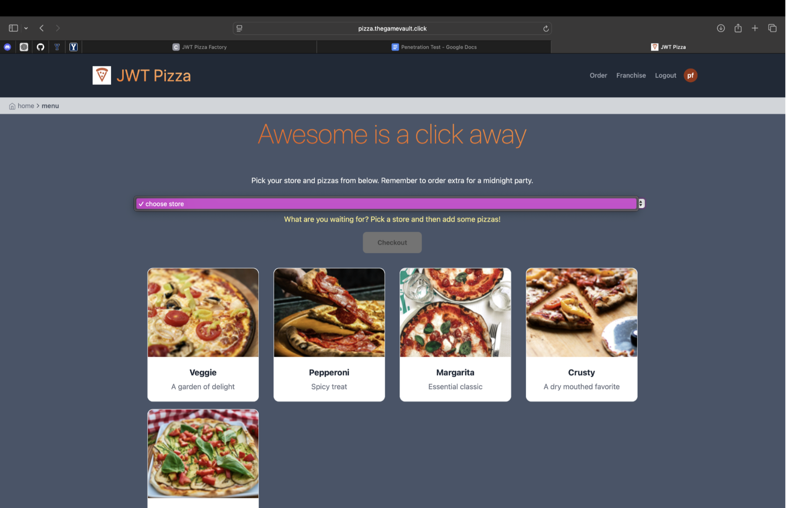
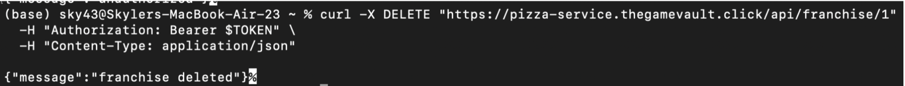

**Corrections**  
(Not specified)

---

## Improper Session Management — Auth Token in Local Storage

| Item                                | Result             | Date             | Target                   | Classification              | Severity |
| ----------------------------------- | ------------------ | ---------------- | ------------------------ | --------------------------- | -------- |
| Auth Token Visible in Local Storage | Auth token visible | December 5, 2025 | pizza.thegamevault.click | Improper Session Management | 1        |

**Description**  
Able to see a user’s auth token in local storage.

**Images**  
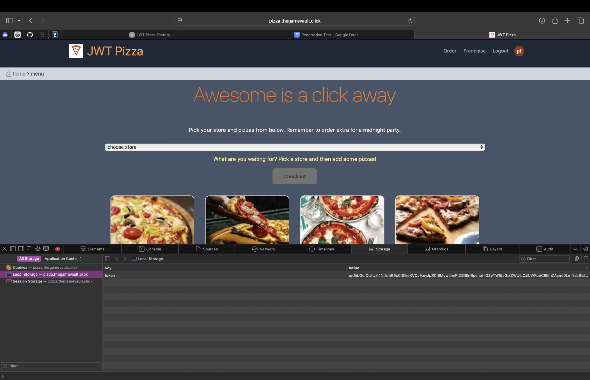

**Corrections**  
(Not specified)

---

## Server-Side Request Forgery (SSRF) — Franchise Info Accessible

| Item                             | Result                         | Date             | Target               | Classification              | Severity |
| -------------------------------- | ------------------------------ | ---------------- | -------------------- | --------------------------- | -------- |
| SSRF — Franchise Info Accessible | Able to request franchise info | December 4, 2025 | pizza.skycs329.click | Server Side Request Forgery | 2        |

**Description**  
Able to request the franchises and see the info that goes with them.

**Images**  
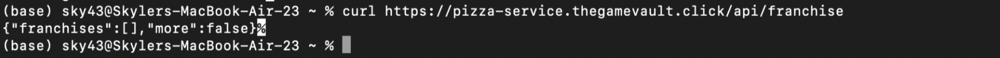

**Corrections**  
Added auth token requirement.

# Sumarry
This was a fun assignment to see how many ways there are to hack into someones site. It helped me see that as a developer, I need to take security seriously, especially when dealing with other peoples information. Thinking like a hacker really did help me view my code in a different light and see the vulnerabilites there. I'll definitely be taking the things I've learned here into my work and future career. 

This assignment taught me the importance of securing my information and what a random user can access. Not everything may be apparent on the
outside, but testing and penetrating my own website as well as the experience of attacking someone elses website I was able to see that it is important to secure your own data. I also noticed the power of using the terminal and curl commands to access data that should be safe on the backend.